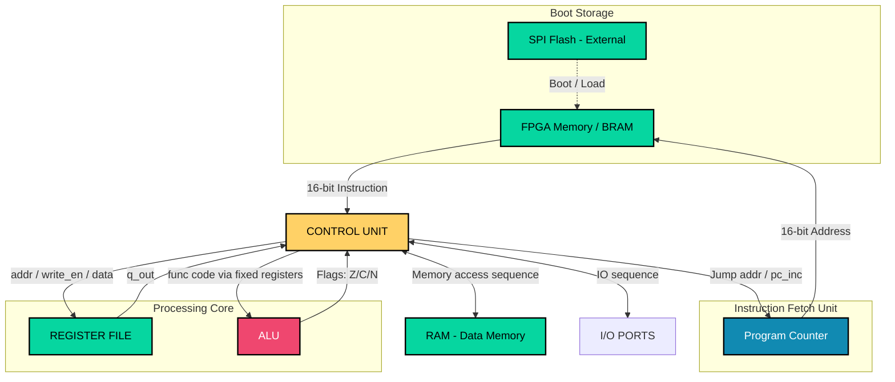

# MNPK01-System: Full-Stack 8-bit Microcomputer

## 📌 Project Overview
**MNPK01-System** is a 8-bit microcomputer architecture, engineered from the silicon level up to the physical PCB. Developed as a comprehensive graduation thesis, this project bridges the gap between Hardware Description Languages (HDL) and physical hardware implementation.

The core mission of the MNPK01 is to demonstrate a **complete vertical integration** of computer systems: from logical gate synthesis and custom Instruction Set Architecture (ISA) to physical PCB fabrication and low-level firmware optimization.

---

## 🏗 System Architecture

The heart of the MNPK-01 is a modular **Resource Handler-centric** design. By utilizing a centralized bus management system, the architecture eliminates data contention and provides a streamlined path for 8-bit operations with 16-bit addressing capabilities.

### Integrated System Map

