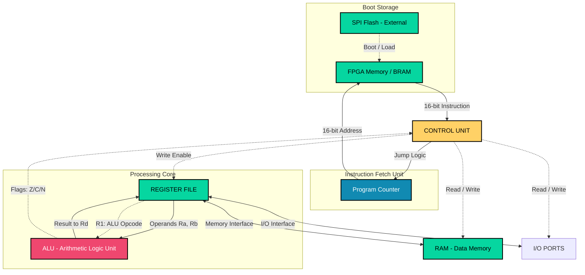

# MNPK01-System: Full-Stack 16-bit Microcomputer


📖 **Documentation:** [krivanikm.github.io/mnpk01-soc](https://krivanikm.github.io/mnpk01-soc/) (English / Slovenčina)

## 📌 Project Overview
**MNPK01-System** is a 16-bit microcomputer architecture, designed from the logic level up to the physical PCB. Developed as a SOČ (Slovak high-school research competition) project, it bridges the gap between Hardware Description Languages (HDL) and physical hardware implementation.

The core mission of the MNPK01 is to demonstrate a **complete vertical integration** of computer systems: from logical gate synthesis and custom Instruction Set Architecture (ISA) to physical PCB fabrication and low-level firmware optimization.

---

## 🏗 System Architecture

The MNPK-01 uses a Harvard architecture with a 16-bit data path (16 × 16-bit registers, 16-bit ALU) and 16-bit addressing. The **Control Unit** drives every block directly – the register file, the ALU, data memory and I/O – with no separate bus-management unit in between. The ALU is used in a syscall-like way: the operation code is stored in register **R1** and a single `ALU Ra, Rb, Rd` instruction executes it.

### Integrated System Map

```mermaid
graph TD
    %% Global Styling
    classDef control fill:#ffd166,stroke:#000,stroke-width:2px,color:#000;
    classDef storage fill:#06d6a0,stroke:#000,stroke-width:2px,color:#000;
    classDef compute fill:#ef476f,stroke:#000,stroke-width:2px,color:#fff;
    classDef routing fill:#118ab2,stroke:#000,stroke-width:2px,color:#fff;

    subgraph Boot_Configuration [Boot Storage]
        FLASH[SPI Flash - External] -.->|Boot / Load| BRAM[FPGA Memory / BRAM]
    end

    subgraph Instruction_Fetch [Instruction Fetch Unit]
        PC[Program Counter] -->|16-bit Address| BRAM
    end

    BRAM -->|16-bit Instruction| CU[CONTROL UNIT]

    subgraph Execution_Core [Processing Core]
        REGS[REGISTER FILE]
        ALU[ALU - Arithmetic Logic Unit]

        REGS -->|Operands Ra, Rb| ALU
        REGS -.->|R1: ALU Opcode| ALU
        ALU -->|Result to Rd| REGS
    end

    %% Control Signals
    CU -->|Jump Logic| PC
    CU -.->|Write Enable| REGS
    ALU -.->|Flags: Z/C/N| CU

    %% Peripherals
    REGS <-->|Memory Interface| RAM[RAM - Data Memory]
    REGS <-->|I/O Interface| IO[I/O PORTS]
    CU -.->|Read / Write| RAM
    CU -.->|Read / Write| IO

    %% Applying Styles
    class CU control;
    class FLASH,BRAM,RAM,REGS storage;
    class ALU compute;
    class PC routing;
```

> Data memory (RAM) and I/O in the map above are still being designed – see the status below.

---

## 📊 Status

| Part | Status |
|---|---|
| ALU (16-bit, 14 operations) | ✅ done – ~40 million checks |
| Register file (16 × 16-bit) | ✅ done |
| Control unit: NOP, MVI, MVIB, MOV, ALU, JMP | ✅ done – 16/16 system tests, also with synchronous FPGA BRAM |
| Program counter | ✅ done, connected in `system_top` |
| JMP + 6 conditional jumps | ✅ done – loops and decisions |
| LOAD/STORE, RAM | 🔨 next |
| I/O, assembler | 📋 planned |
| FPGA (Tang Nano 9K), PCB | 📋 planned |

## 🚀 Running the simulation

Requirements: [Verilator](https://www.veripool.org/verilator/), a C++ compiler, `make`. Optional: Yosys + Graphviz for schematics.

```sh
cd rtl
make test          # all system tests (combinational and BRAM-like memory)
make test V=1      # with a cycle-by-cycle trace
make alu           # standalone ALU test (~40 million checks)
make schematics    # RTL schematics into docs/assets/schematics/
```

## 📁 Repository layout

```
rtl/
  alu/              ALU + its standalone test
  control-unit/     control unit (FSM)
  registers/        register file
  program-counter/  program counter
  tests/            system test programs (*.txt)
  system_top.sv     top level
  tb_full_system.cpp
docs/               documentation website (GitHub Pages, EN + SK)
```

